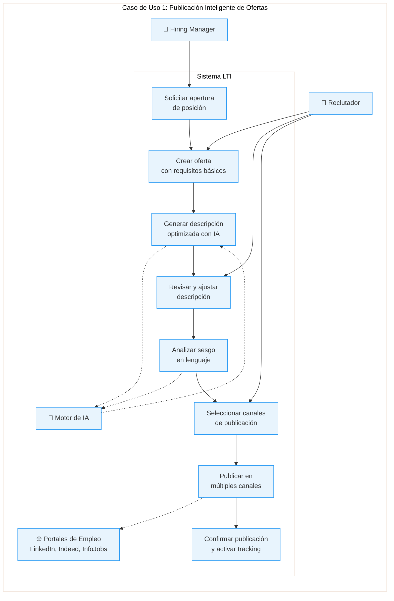
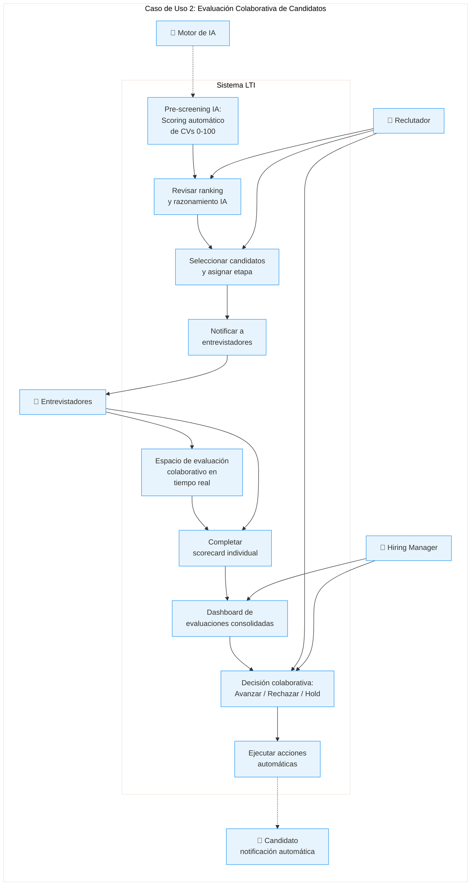
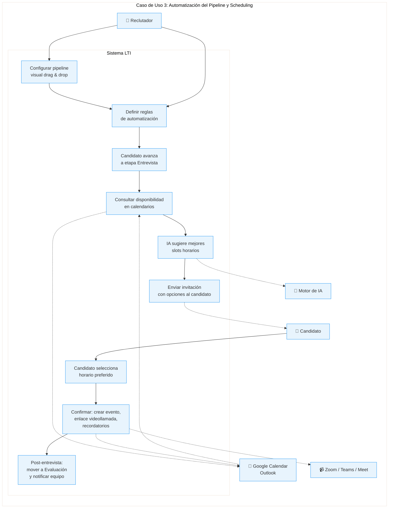
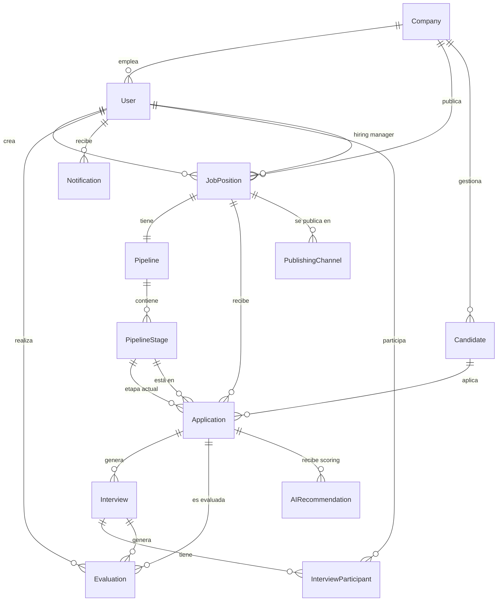
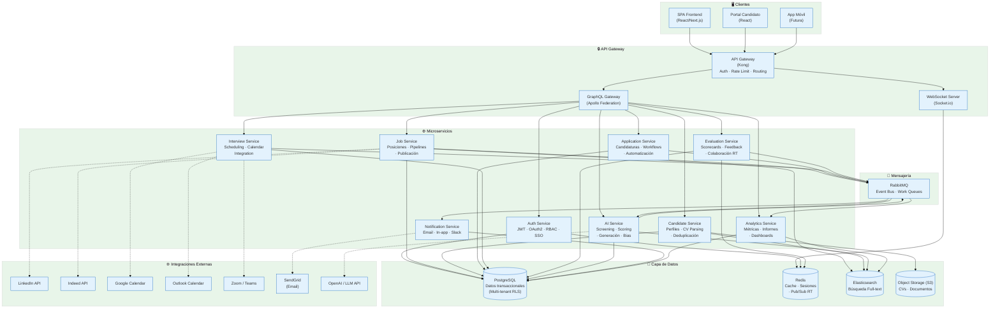
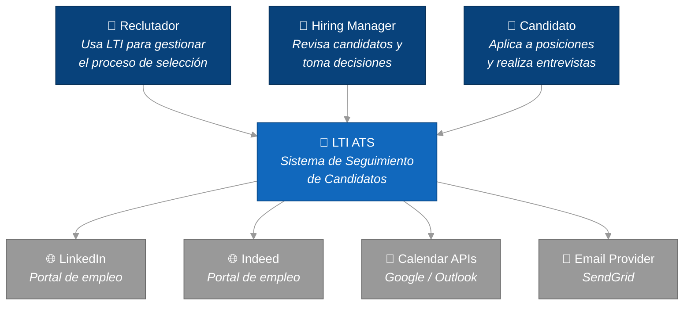
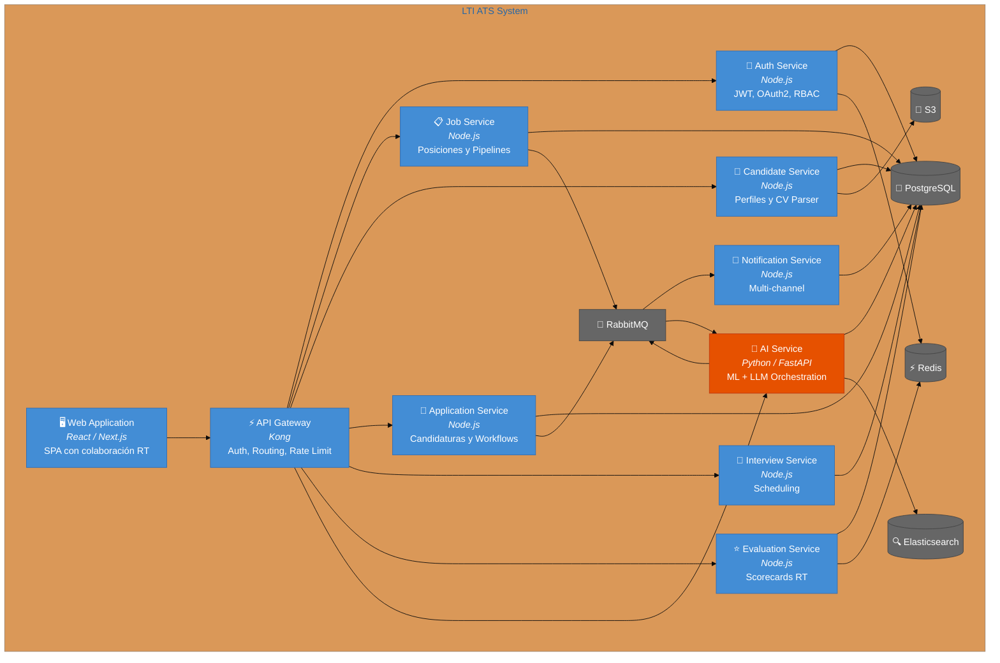

# LTI — Applicant Tracking System del Futuro

---

## 1. Descripción del Software

### 1.1 ¿Qué es LTI?

**LTI** es un sistema de seguimiento de candidatos (ATS) de nueva generación diseñado para transformar el proceso de reclutamiento mediante inteligencia artificial, automatización inteligente y colaboración en tiempo real. A diferencia de los ATS tradicionales que actúan como simples bases de datos de candidatos, LTI se posiciona como un **copiloto de reclutamiento** que asiste activamente a reclutadores y hiring managers en cada etapa del proceso de selección.

LTI nace con la visión de eliminar las ineficiencias que plagan los procesos de contratación actuales: la criba manual de CVs, la descoordinación entre equipos, los cuellos de botella en la toma de decisiones y la pérdida de talento por tiempos de respuesta lentos.

### 1.2 Valor Añadido

| Aspecto | Valor que aporta LTI |
|---|---|
| **Velocidad** | Reduce el time-to-hire en un 60% gracias a la automatización y la priorización asistida por IA |
| **Calidad** | Mejora la calidad de las contrataciones mediante scoring predictivo y análisis de ajuste cultural |
| **Colaboración** | Elimina silos entre RRHH y managers con espacios de trabajo compartidos en tiempo real |
| **Experiencia del candidato** | Comunicación automatizada y personalizada que mantiene al candidato informado y enganchado |
| **Datos accionables** | Dashboards analíticos que identifican cuellos de botella y optimizan el funnel de contratación |

### 1.3 Ventajas Competitivas

**Frente a Greenhouse / Lever (líderes actuales):**
- IA nativa integrada en el core del producto (no como add-on), incluyendo análisis semántico de CVs, generación automática de descripciones de puestos y sugerencias de preguntas de entrevista
- Colaboración en tiempo real tipo Google Docs para evaluaciones (no solo comentarios asíncronos)
- Pricing más accesible con modelo freemium para startups

**Frente a Workday / iCIMS (enterprise):**
- Implementación en minutos vs. meses de onboarding
- UX moderna e intuitiva que no requiere formación
- API-first para integraciones con cualquier stack tecnológico

**Frente a soluciones emergentes (Ashby, Teamtailor):**
- Motor de IA propietario para matching candidato-puesto con explicabilidad (no caja negra)
- Automatización de workflows sin código (drag & drop)
- Detección proactiva de sesgos en el proceso de selección

### 1.4 Funciones Principales

#### 🔍 1. Publicación y Distribución Multicanal de Ofertas
- Creación asistida por IA de descripciones de puesto optimizadas para SEO y diversidad
- Publicación simultánea en +50 portales de empleo (LinkedIn, Indeed, InfoJobs, etc.)
- Página de carreras personalizable con marca de empleador
- Seguimiento de rendimiento por canal de origen

#### 🤖 2. Screening Inteligente con IA
- Análisis semántico de CVs y perfiles (no solo keyword matching)
- Scoring automático de candidatos según fit con el puesto
- Detección de habilidades transferibles y potencial de crecimiento
- Alertas de posibles sesgos en la evaluación

#### 🤝 3. Colaboración en Tiempo Real
- Espacios de evaluación compartidos entre reclutadores y hiring managers
- Scorecards colaborativas con edición simultánea
- Sistema de menciones y notificaciones contextuales
- Flujo de aprobaciones configurable con SLAs

#### ⚡ 4. Automatización de Workflows
- Constructor visual de pipelines de selección (drag & drop)
- Triggers automáticos: emails, movimiento entre etapas, asignación de tareas
- Programación automática de entrevistas con sincronización de calendarios
- Recordatorios y escalaciones automáticas por inactividad

#### 📊 5. Analytics y Reporting
- Dashboard en tiempo real con métricas clave (time-to-hire, cost-per-hire, conversion rates)
- Informes de diversidad e inclusión
- Análisis predictivo de pipeline (probabilidad de cierre por posición)
- Benchmarking contra datos de industria

#### 💬 6. Comunicación y Experiencia del Candidato
- Portal del candidato con seguimiento del estado de su aplicación
- Chatbot conversacional para preguntas frecuentes y pre-screening
- Emails y mensajes automáticos personalizados en cada etapa
- Encuestas de experiencia del candidato (NPS)

### 1.5 Lean Canvas

```
┌───────────────────────────────────────────────────────────────────────────────────────────────────────┐
│                                        LEAN CANVAS — LTI ATS                                        │
├───────────────────┬───────────────────┬───────────────────┬───────────────────┬───────────────────────┤
│                   │                   │                   │                   │                       │
│   PROBLEMA        │   SOLUCIÓN        │  PROPUESTA DE     │  VENTAJA          │   SEGMENTO DE         │
│                   │                   │  VALOR ÚNICA      │  DIFERENCIAL      │   CLIENTES            │
│ 1. Criba manual   │ 1. Screening IA   │                   │                   │                       │
│    de CVs consume │    con scoring    │  "El copiloto de  │ Motor de IA       │ • Startups y scale-   │
│    el 70% del     │    automático     │  reclutamiento    │ propietario con   │   ups en crecimiento  │
│    tiempo del     │                   │  que reduce tu    │ explicabilidad    │   (50-500 empleados)  │
│    reclutador     │ 2. Espacios de    │  time-to-hire     │ que va más allá   │                       │
│                   │    evaluación     │  un 60% con IA    │ del keyword       │ • Departamentos HR    │
│ 2. Descoordina-   │    colaborativos  │  nativa y         │ matching,         │   de medianas         │
│    ción entre     │    en tiempo real │  colaboración     │ detectando        │   empresas            │
│    reclutadores   │                   │  en tiempo real"  │ habilidades       │   (500-5000)          │
│    y managers     │ 3. Builder visual │                   │ transferibles     │                       │
│                   │    de workflows   │                   │ y potencial       │ • Agencias de         │
│ 3. Pérdida de     │    sin código     │                   │                   │   reclutamiento       │
│    talento por    │                   │                   │                   │                       │
│    procesos       │                   │                   │                   │                       │
│    lentos         │                   │                   │                   │                       │
├───────────────────┴───────────────────┤                   ├───────────────────┴───────────────────────┤
│                                       │                   │                                           │
│   MÉTRICAS CLAVE                      │                   │   CANALES                                 │
│                                       │                   │                                           │
│ • Time-to-hire promedio               │                   │ • Marketing de contenido (SEO/blog)       │
│ • Tasa de conversión del pipeline     │                   │ • Partnerships con portales de empleo     │
│ • NPS de candidatos                   │                   │ • Freemium + PLG (product-led growth)     │
│ • Retención de clientes (churn)       │                   │ • Comunidad HR en LinkedIn                │
│ • MRR / ARR                           │                   │ • Programa de referidos                   │
│                                       │                   │                                           │
├───────────────────────────────────────┴───────────────────┴───────────────────────────────────────────┤
│                                                                                                       │
│   ESTRUCTURA DE COSTES                              │   FUENTES DE INGRESOS                           │
│                                                     │                                                 │
│ • Infraestructura cloud (AWS/GCP)                   │ • SaaS por suscripción mensual/anual            │
│ • Equipo de desarrollo (ingeniería + IA/ML)         │   - Free: hasta 5 posiciones activas            │
│ • Costes de integración con job boards              │   - Pro: €199/mes (posiciones ilimitadas)       │
│ • Marketing y adquisición de clientes               │   - Enterprise: personalizado                   │
│ • Soporte al cliente                                │ • Servicios premium de IA (análisis avanzado)   │
│ • Costes de procesamiento IA (GPUs, APIs LLM)       │ • Marketplace de integraciones                  │
│                                                     │ • Servicios de implementación enterprise        │
│                                                                                                       │
└───────────────────────────────────────────────────────────────────────────────────────────────────────┘
```

---

## 2. Casos de Uso Principales

### 2.1 Caso de Uso 1: Publicación y Distribución Inteligente de Ofertas

**Actor principal:** Reclutador  
**Actores secundarios:** Hiring Manager, Sistema de IA, Portales de empleo externos  
**Precondición:** El reclutador está autenticado y tiene permisos de creación de ofertas  
**Postcondición:** La oferta está publicada en los canales seleccionados y en la página de carreras

**Flujo principal:**
1. El Hiring Manager solicita la apertura de una nueva posición
2. El reclutador crea una nueva oferta de empleo introduciendo los requisitos básicos (título, departamento, nivel)
3. El sistema de IA genera automáticamente una descripción optimizada del puesto basándose en los requisitos y en datos de ofertas similares exitosas
4. El reclutador revisa y ajusta la descripción generada
5. El sistema analiza la descripción en busca de lenguaje con sesgo y sugiere alternativas inclusivas
6. El reclutador selecciona los canales de publicación (portales de empleo, redes sociales, página de carreras)
7. El sistema publica simultáneamente en todos los canales seleccionados
8. El sistema confirma la publicación y activa el tracking de candidaturas por canal

**Flujo alternativo:**
- 3a. Si la IA no tiene datos suficientes, sugiere una plantilla base que el reclutador completa manualmente
- 6a. El reclutador puede programar la publicación para una fecha futura
- 7a. Si un canal falla, el sistema notifica y reintenta automáticamente



---

### 2.2 Caso de Uso 2: Evaluación Colaborativa de Candidatos

**Actor principal:** Reclutador  
**Actores secundarios:** Hiring Manager, Entrevistadores, Sistema de IA  
**Precondición:** Existen candidaturas recibidas para una posición activa  
**Postcondición:** Los candidatos están evaluados y clasificados con consenso del equipo

**Flujo principal:**
1. El sistema de IA realiza un pre-screening automático de los CVs recibidos, generando un score de ajuste (0-100) para cada candidato
2. El reclutador revisa el ranking generado por la IA y el razonamiento de cada puntuación
3. El reclutador selecciona candidatos para avanzar y los asigna a una etapa de evaluación
4. El sistema notifica automáticamente a los entrevistadores asignados
5. Los entrevistadores acceden al espacio de evaluación compartido donde ven el perfil del candidato, la scorecard y las notas de otros evaluadores en tiempo real
6. Cada entrevistador completa su scorecard con puntuaciones y comentarios
7. El hiring manager revisa las evaluaciones consolidadas en un dashboard
8. El equipo toma una decisión colaborativa (avanzar, rechazar, hold) visible para todos en tiempo real
9. El sistema ejecuta automáticamente las acciones asociadas (email al candidato, movimiento en el pipeline)

**Flujo alternativo:**
- 1a. Si un CV no es parseable, el sistema solicita revisión manual
- 5a. Si un entrevistador no completa la evaluación en el plazo configurado, el sistema envía recordatorios y escala al reclutador
- 8a. Si no hay consenso, el sistema agenda una reunión de calibración automáticamente



---

### 2.3 Caso de Uso 3: Automatización del Pipeline con Programación de Entrevistas

**Actor principal:** Reclutador  
**Actores secundarios:** Candidato, Entrevistadores, Sistema de IA, Calendarios externos  
**Precondición:** Un candidato ha sido aprobado para la fase de entrevistas  
**Postcondición:** Las entrevistas están programadas y todos los participantes notificados

**Flujo principal:**
1. El reclutador configura el pipeline de selección para la posición usando el builder visual (drag & drop de etapas)
2. El reclutador define las reglas de automatización para cada transición entre etapas (ej.: "al pasar a Entrevista Técnica → programar entrevista con el tech lead")
3. Un candidato es movido a la etapa "Entrevista" (manual o automáticamente por regla previa)
4. El sistema consulta la disponibilidad de los entrevistadores y del candidato a través de las integraciones de calendario (Google Calendar, Outlook)
5. El sistema de IA sugiere los mejores slots considerando zonas horarias, carga de entrevistas del equipo y preferencias del candidato
6. El sistema envía una invitación al candidato con las opciones de horario disponibles
7. El candidato selecciona su horario preferido desde el portal del candidato
8. El sistema confirma la cita, crea el evento en todos los calendarios, genera el enlace de videollamada y envía recordatorios programados
9. Tras la entrevista, el sistema mueve automáticamente al candidato a la etapa de evaluación y notifica a los evaluadores

**Flujo alternativo:**
- 4a. Si no hay disponibilidad común en los próximos 5 días, el sistema sugiere entrevistadores alternativos
- 7a. Si el candidato no responde en 48h, el sistema envía un recordatorio automático
- 9a. Si el candidato cancela, el sistema libera el slot y reinicia el proceso de scheduling



---

## 3. Modelo de Datos

### 3.1 Entidades y Atributos

#### Company (Empresa)
| Atributo | Tipo | Descripción |
|---|---|---|
| id | UUID (PK) | Identificador único |
| name | VARCHAR(255) | Nombre de la empresa |
| industry | VARCHAR(100) | Sector/industria |
| size_range | VARCHAR(50) | Rango de empleados |
| logo_url | TEXT | URL del logotipo |
| careers_page_slug | VARCHAR(100) | Slug para página de carreras |
| subscription_plan | ENUM | Plan: free, pro, enterprise |
| created_at | TIMESTAMP | Fecha de creación |
| updated_at | TIMESTAMP | Última actualización |

#### User (Usuario)
| Atributo | Tipo | Descripción |
|---|---|---|
| id | UUID (PK) | Identificador único |
| company_id | UUID (FK) | Empresa a la que pertenece |
| email | VARCHAR(255) | Email (único por empresa) |
| password_hash | VARCHAR(255) | Hash de contraseña |
| first_name | VARCHAR(100) | Nombre |
| last_name | VARCHAR(100) | Apellido |
| role | ENUM | Rol: admin, recruiter, hiring_manager, interviewer |
| avatar_url | TEXT | URL del avatar |
| calendar_integration | JSONB | Config. de integración de calendario |
| is_active | BOOLEAN | Estado activo/inactivo |
| created_at | TIMESTAMP | Fecha de creación |
| updated_at | TIMESTAMP | Última actualización |

#### JobPosition (Posición/Oferta)
| Atributo | Tipo | Descripción |
|---|---|---|
| id | UUID (PK) | Identificador único |
| company_id | UUID (FK) | Empresa propietaria |
| created_by | UUID (FK) | Reclutador que la creó |
| hiring_manager_id | UUID (FK) | Hiring manager responsable |
| title | VARCHAR(255) | Título del puesto |
| description | TEXT | Descripción completa |
| requirements | TEXT | Requisitos del puesto |
| department | VARCHAR(100) | Departamento |
| location | VARCHAR(255) | Ubicación (presencial/remoto/híbrido) |
| employment_type | ENUM | Tipo: full_time, part_time, contract, internship |
| salary_min | DECIMAL(12,2) | Salario mínimo |
| salary_max | DECIMAL(12,2) | Salario máximo |
| salary_currency | VARCHAR(3) | Moneda (EUR, USD, etc.) |
| status | ENUM | Estado: draft, open, paused, closed, filled |
| published_at | TIMESTAMP | Fecha de publicación |
| closes_at | TIMESTAMP | Fecha de cierre |
| created_at | TIMESTAMP | Fecha de creación |
| updated_at | TIMESTAMP | Última actualización |

#### Pipeline (Pipeline de Selección)
| Atributo | Tipo | Descripción |
|---|---|---|
| id | UUID (PK) | Identificador único |
| job_position_id | UUID (FK) | Posición asociada |
| name | VARCHAR(255) | Nombre del pipeline |
| is_default | BOOLEAN | Si es pipeline por defecto |
| created_at | TIMESTAMP | Fecha de creación |

#### PipelineStage (Etapa del Pipeline)
| Atributo | Tipo | Descripción |
|---|---|---|
| id | UUID (PK) | Identificador único |
| pipeline_id | UUID (FK) | Pipeline al que pertenece |
| name | VARCHAR(100) | Nombre de la etapa |
| stage_type | ENUM | Tipo: screening, interview, evaluation, offer, custom |
| order_index | INTEGER | Orden en el pipeline |
| automation_rules | JSONB | Reglas de automatización |
| sla_hours | INTEGER | SLA en horas para esta etapa |
| created_at | TIMESTAMP | Fecha de creación |

#### Candidate (Candidato)
| Atributo | Tipo | Descripción |
|---|---|---|
| id | UUID (PK) | Identificador único |
| company_id | UUID (FK) | Empresa (tenant) |
| email | VARCHAR(255) | Email del candidato |
| first_name | VARCHAR(100) | Nombre |
| last_name | VARCHAR(100) | Apellido |
| phone | VARCHAR(50) | Teléfono |
| linkedin_url | TEXT | Perfil de LinkedIn |
| resume_url | TEXT | URL del CV almacenado |
| resume_parsed | JSONB | CV parseado en formato estructurado |
| source | VARCHAR(100) | Canal de origen |
| tags | TEXT[] | Etiquetas/tags |
| created_at | TIMESTAMP | Fecha de creación |
| updated_at | TIMESTAMP | Última actualización |

#### Application (Candidatura)
| Atributo | Tipo | Descripción |
|---|---|---|
| id | UUID (PK) | Identificador único |
| candidate_id | UUID (FK) | Candidato |
| job_position_id | UUID (FK) | Posición a la que aplica |
| current_stage_id | UUID (FK) | Etapa actual en el pipeline |
| status | ENUM | Estado: active, withdrawn, rejected, hired |
| applied_at | TIMESTAMP | Fecha de aplicación |
| rejection_reason | TEXT | Motivo de rechazo (si aplica) |
| created_at | TIMESTAMP | Fecha de creación |
| updated_at | TIMESTAMP | Última actualización |

#### Interview (Entrevista)
| Atributo | Tipo | Descripción |
|---|---|---|
| id | UUID (PK) | Identificador único |
| application_id | UUID (FK) | Candidatura asociada |
| interview_type | ENUM | Tipo: phone_screen, technical, behavioral, final |
| scheduled_at | TIMESTAMP | Fecha/hora programada |
| duration_minutes | INTEGER | Duración en minutos |
| location | TEXT | Ubicación o enlace de videollamada |
| meeting_url | TEXT | URL de la reunión virtual |
| status | ENUM | Estado: scheduled, completed, cancelled, no_show |
| calendar_event_id | VARCHAR(255) | ID del evento en calendario externo |
| notes | TEXT | Notas generales de la entrevista |
| created_at | TIMESTAMP | Fecha de creación |
| updated_at | TIMESTAMP | Última actualización |

#### InterviewParticipant (Participante de Entrevista)
| Atributo | Tipo | Descripción |
|---|---|---|
| id | UUID (PK) | Identificador único |
| interview_id | UUID (FK) | Entrevista |
| user_id | UUID (FK) | Usuario entrevistador |
| role | ENUM | Rol: lead, panel, observer |
| confirmed | BOOLEAN | Si ha confirmado asistencia |

#### Evaluation (Evaluación)
| Atributo | Tipo | Descripción |
|---|---|---|
| id | UUID (PK) | Identificador único |
| application_id | UUID (FK) | Candidatura evaluada |
| interview_id | UUID (FK) | Entrevista asociada (nullable) |
| evaluator_id | UUID (FK) | Usuario que evalúa |
| overall_score | DECIMAL(3,1) | Puntuación global (0-10) |
| scorecard | JSONB | Puntuaciones detalladas por criterio |
| strengths | TEXT | Fortalezas observadas |
| concerns | TEXT | Áreas de preocupación |
| recommendation | ENUM | Recomendación: strong_hire, hire, no_hire, strong_no_hire |
| created_at | TIMESTAMP | Fecha de creación |
| updated_at | TIMESTAMP | Última actualización |

#### AIRecommendation (Recomendación de IA)
| Atributo | Tipo | Descripción |
|---|---|---|
| id | UUID (PK) | Identificador único |
| application_id | UUID (FK) | Candidatura analizada |
| fit_score | DECIMAL(5,2) | Score de ajuste (0-100) |
| skill_match | JSONB | Detalle de match por habilidad |
| experience_match | JSONB | Detalle de match por experiencia |
| culture_fit_score | DECIMAL(5,2) | Score de ajuste cultural |
| reasoning | TEXT | Explicación del razonamiento de la IA |
| bias_flags | JSONB | Alertas de posible sesgo detectado |
| model_version | VARCHAR(50) | Versión del modelo utilizado |
| created_at | TIMESTAMP | Fecha de creación |

#### Notification (Notificación)
| Atributo | Tipo | Descripción |
|---|---|---|
| id | UUID (PK) | Identificador único |
| user_id | UUID (FK) | Usuario destinatario |
| type | ENUM | Tipo: new_application, evaluation_pending, interview_reminder, sla_breach |
| title | VARCHAR(255) | Título de la notificación |
| message | TEXT | Contenido |
| reference_type | VARCHAR(50) | Tipo de entidad referenciada |
| reference_id | UUID | ID de la entidad referenciada |
| is_read | BOOLEAN | Leída/no leída |
| created_at | TIMESTAMP | Fecha de creación |

#### PublishingChannel (Canal de Publicación)
| Atributo | Tipo | Descripción |
|---|---|---|
| id | UUID (PK) | Identificador único |
| job_position_id | UUID (FK) | Posición publicada |
| channel_type | ENUM | Canal: linkedin, indeed, infojobs, careers_page, custom |
| external_id | VARCHAR(255) | ID en el sistema externo |
| status | ENUM | Estado: pending, published, failed, expired |
| published_at | TIMESTAMP | Fecha de publicación |
| metrics | JSONB | Métricas (views, clicks, applies) |

### 3.2 Diagrama Entidad-Relación



### 3.3 Relaciones principales

| Relación | Cardinalidad | Descripción |
|---|---|---|
| Company → User | 1:N | Una empresa tiene muchos usuarios |
| Company → JobPosition | 1:N | Una empresa publica muchas posiciones |
| Company → Candidate | 1:N | Una empresa gestiona muchos candidatos (multi-tenant) |
| JobPosition → Pipeline | 1:1 | Cada posición tiene un pipeline de selección |
| Pipeline → PipelineStage | 1:N | Un pipeline tiene múltiples etapas ordenadas |
| JobPosition → Application | 1:N | Una posición recibe muchas candidaturas |
| Candidate → Application | 1:N | Un candidato puede aplicar a varias posiciones |
| Application → Interview | 1:N | Una candidatura puede tener varias entrevistas |
| Interview → InterviewParticipant | 1:N | Una entrevista tiene varios participantes |
| Application → Evaluation | 1:N | Una candidatura recibe varias evaluaciones |
| Application → AIRecommendation | 1:N | Una candidatura puede tener varios scorings IA |
| JobPosition → PublishingChannel | 1:N | Una posición se publica en varios canales |

---

## 4. Diseño del Sistema a Alto Nivel

### 4.1 Descripción de la Arquitectura

LTI sigue una **arquitectura de microservicios** desplegada en la nube (AWS/GCP), con un enfoque **API-first** que permite tanto el consumo desde el frontend web como futuras integraciones con terceros.

#### Capas principales:

**1. Capa de Presentación**
- **SPA Frontend (React/Next.js)**: Aplicación web responsive con capacidades de tiempo real (WebSocket) para la colaboración entre usuarios. Incluye el portal del reclutador, el panel del hiring manager y el portal del candidato.
- **Portal del Candidato**: Interfaz pública donde los candidatos pueden aplicar, consultar el estado de sus candidaturas y programar entrevistas.

**2. Capa de API**
- **API Gateway (Kong/AWS API Gateway)**: Punto de entrada único que gestiona autenticación, rate limiting, routing y load balancing. Expone una API REST y endpoints WebSocket para tiempo real.
- **GraphQL Gateway**: Capa de agregación que permite al frontend hacer queries eficientes que cruzan múltiples servicios.

**3. Capa de Servicios de Negocio**
- **Auth Service**: Gestión de autenticación (JWT + OAuth2), autorización RBAC y gestión de sesiones. Soporta SSO enterprise (SAML/OIDC).
- **Job Service**: CRUD de posiciones, gestión de pipelines y publicación en canales externos.
- **Candidate Service**: Gestión de perfiles de candidatos, parsing de CVs y deduplicación.
- **Application Service**: Gestión del ciclo de vida de candidaturas, movimiento entre etapas y automatización de workflows.
- **Interview Service**: Programación de entrevistas, integración con calendarios y gestión de disponibilidad.
- **Evaluation Service**: Scorecards colaborativas, evaluaciones en tiempo real y consolidación de feedback.
- **AI Service**: Motor de IA para screening, scoring, generación de contenido y detección de sesgos und recomendaciones.
- **Notification Service**: Orquestación de notificaciones multicanal (in-app, email, Slack).
- **Analytics Service**: Procesamiento de métricas, generación de informes y dashboards.

**4. Capa de Datos**
- **PostgreSQL**: Base de datos relacional principal para datos transaccionales (multi-tenant con Row Level Security).
- **Redis**: Cache distribuida para sesiones, datos de tiempo real y rate limiting.
- **Elasticsearch**: Búsqueda full-text de candidatos y ofertas.
- **S3/Object Storage**: Almacenamiento de archivos (CVs, documentos, assets).

**5. Capa de Mensajería e Integración**
- **Message Broker (RabbitMQ)**: Comunicación asíncrona entre microservicios, gestión de eventos y colas de trabajo.
- **Integraciones externas**: LinkedIn, Indeed, Google Calendar, Outlook, Zoom/Teams, proveedores de email (SendGrid).

**6. Capa de Infraestructura**
- **Kubernetes**: Orquestación de contenedores para escalado automático.
- **Observabilidad**: Monitorización (Prometheus/Grafana), logging centralizado (ELK) y tracing distribuido (Jaeger).

#### Decisiones arquitectónicas clave:
- **Multi-tenancy**: Aislamiento por empresa usando Row Level Security en PostgreSQL, permitiendo eficiencia de recursos sin comprometer la seguridad.
- **Event-driven**: Los servicios se comunican mediante eventos asíncronos para desacoplamiento y resiliencia.
- **Real-time collaboration**: WebSocket con Redis Pub/Sub para sincronización en tiempo real de evaluaciones.
- **AI como servicio**: El servicio de IA se despliega independientemente con su propio ciclo de vida y puede escalar según demanda de inferencia.

### 4.2 Diagrama de Arquitectura de Alto Nivel



---

## 5. Diagrama C4: AI Service (Servicio de Inteligencia Artificial)

Se ha seleccionado el **AI Service** como componente para profundizar, ya que es el principal diferenciador competitivo de LTI y el servicio con mayor complejidad técnica.

### 5.1 Nivel 1 — Contexto del Sistema



### 5.2 Nivel 2 — Contenedores



### 5.3 Nivel 3 — Componentes del AI Service

```mermaid
%%{init: {'theme': 'base', 'themeVariables': {'primaryColor': '#E65100', 'primaryTextColor': '#fff'}}}%%

graph TB
    subgraph AIService["🤖 AI Service (Python / FastAPI)"]
        direction TB
        
        APILAY["🌐 AI API Layer<br/><i>FastAPI Router</i><br/>Endpoints REST para<br/>otros microservicios"]

        subgraph Core["Core AI Components"]
            SCREEN["📄 CV Screening Engine<br/><i>spaCy + Transformers</i><br/>Parseo semántico de CVs,<br/>extracción de entidades<br/>(skills, experiencia, educación)"]
            
            MATCH["🎯 Candidate Matching Engine<br/><i>Sentence Transformers</i><br/>Scoring de ajuste candidato-<br/>puesto usando embeddings<br/>semánticos (0-100)"]
            
            BIAS["⚖️ Bias Detection Module<br/><i>Fairlearn + Custom Rules</i><br/>Análisis de sesgo en<br/>descripciones de puesto<br/>y evaluaciones"]
            
            GENAI["✍️ Generative AI Module<br/><i>LLM Orchestrator (LangChain)</i><br/>Generación de descripciones,<br/>preguntas de entrevista,<br/>resúmenes de candidatos"]
            
            PREDICT["📊 Predictive Analytics Engine<br/><i>scikit-learn + XGBoost</i><br/>Predicción de time-to-hire,<br/>probabilidad de aceptación,<br/>riesgo de abandono"]
        end

        subgraph Infrastructure["Infrastructure Components"]
            EMBED["🧮 Embedding Store<br/><i>pgvector / Qdrant</i><br/>Almacena y busca vectores<br/>de CVs y descripciones<br/>de puesto"]
            
            CACHE["⚡ Model Cache<br/><i>Redis</i><br/>Cache de inferencias<br/>recientes y embeddings<br/>frecuentes"]
            
            QUEUE["📥 Task Queue Consumer<br/><i>Celery + RabbitMQ</i><br/>Procesa tareas async:<br/>bulk screening, retraining,<br/>batch scoring"]
            
            LLM["🔗 LLM Gateway<br/><i>LiteLLM</i><br/>Abstracción multi-proveedor:<br/>OpenAI, Anthropic, local<br/>Con fallback y retry"]
        end

        subgraph MLOps["MLOps & Governance"]
            REGISTRY["📦 Model Registry<br/><i>MLflow</i><br/>Versionado de modelos,<br/>métricas de rendimiento,<br/>rollback"]
            
            MONITOR["📈 Model Monitor<br/><i>Evidently AI</i><br/>Detección de data drift,<br/>degradación de performance,<br/>alertas"]
            
            EXPLAIN["🔍 Explainability Engine<br/><i>SHAP + LIME</i><br/>Generación de explicaciones<br/>humanas para cada<br/>recomendación de IA"]
        end
    end

    %% External connections
    APP_SVC["Application Service"]
    JOB_SVC["Job Service"]
    EVAL_SVC["Evaluation Service"]
    RABBIT["RabbitMQ"]
    PG[("PostgreSQL")]
    REDIS_EXT[("Redis")]
    ES[("Elasticsearch")]
    OPENAI["OpenAI API"]
    ANTHROPIC["Anthropic API"]

    APP_SVC -->|"POST /ai/screen"| APILAY
    JOB_SVC -->|"POST /ai/generate-description"| APILAY
    EVAL_SVC -->|"POST /ai/bias-check"| APILAY
    RABBIT -->|"screening.requested"| QUEUE

    APILAY --> SCREEN
    APILAY --> MATCH
    APILAY --> BIAS
    APILAY --> GENAI
    APILAY --> PREDICT

    SCREEN --> EMBED
    MATCH --> EMBED
    GENAI --> LLM
    
    LLM --> OPENAI
    LLM --> ANTHROPIC
    
    SCREEN --> CACHE
    MATCH --> CACHE
    
    QUEUE --> SCREEN
    QUEUE --> MATCH

    SCREEN --> PG
    MATCH --> PG
    MATCH --> ES
    PREDICT --> PG
    CACHE --> REDIS_EXT
    
    REGISTRY --> PG
    MONITOR --> REGISTRY
    EXPLAIN --> MATCH
    EXPLAIN --> SCREEN

    style APILAY fill:#E65100,stroke:#BF360C,color:#fff
    style SCREEN fill:#FF8F00,stroke:#E65100,color:#fff
    style MATCH fill:#FF8F00,stroke:#E65100,color:#fff
    style BIAS fill:#FF8F00,stroke:#E65100,color:#fff
    style GENAI fill:#FF8F00,stroke:#E65100,color:#fff
    style PREDICT fill:#FF8F00,stroke:#E65100,color:#fff
    style EMBED fill:#795548,stroke:#5D4037,color:#fff
    style CACHE fill:#795548,stroke:#5D4037,color:#fff
    style QUEUE fill:#795548,stroke:#5D4037,color:#fff
    style LLM fill:#795548,stroke:#5D4037,color:#fff
    style REGISTRY fill:#4E342E,stroke:#3E2723,color:#fff
    style MONITOR fill:#4E342E,stroke:#3E2723,color:#fff
    style EXPLAIN fill:#4E342E,stroke:#3E2723,color:#fff
    
    style APP_SVC fill:#438DD5,stroke:#2E6DB4,color:#fff
    style JOB_SVC fill:#438DD5,stroke:#2E6DB4,color:#fff
    style EVAL_SVC fill:#438DD5,stroke:#2E6DB4,color:#fff
```



### 5.4 Descripción de Componentes del AI Service

| Componente | Tecnología | Responsabilidad |
|---|---|---|
| **AI API Layer** | FastAPI | Expone endpoints REST consumidos por otros microservicios. Gestiona autenticación service-to-service y rate limiting |
| **CV Screening Engine** | spaCy + Transformers | Parsea CVs semánticamente, extrae entidades (habilidades, experiencia, educación) y los estructura para matching |
| **Candidate Matching Engine** | Sentence Transformers | Calcula similarity score entre el perfil del candidato y los requisitos del puesto usando embeddings semánticos |
| **Bias Detection Module** | Fairlearn + reglas custom | Analiza descripciones de puesto y evaluaciones en busca de lenguaje con sesgo de género, edad, o etnia |
| **Generative AI Module** | LangChain + LLMs | Orquesta llamadas a LLMs para generar descripciones de puesto, preguntas de entrevista y resúmenes de candidatos |
| **Predictive Analytics Engine** | scikit-learn + XGBoost | Modelos predictivos para time-to-hire, probabilidad de aceptación de oferta y riesgo de abandono en pipeline |
| **Embedding Store** | pgvector / Qdrant | Base de datos vectorial para almacenar y buscar embeddings de CVs y descripciones de puesto |
| **Model Cache** | Redis | Cache de inferencias recientes para evitar recomputación y reducir latencia |
| **Task Queue Consumer** | Celery + RabbitMQ | Procesa tareas asíncronas pesadas: screening masivo, re-entrenamiento de modelos, scoring por lotes |
| **LLM Gateway** | LiteLLM | Abstracción sobre múltiples proveedores de LLM (OpenAI, Anthropic) con fallback, retry y control de costes |
| **Model Registry** | MLflow | Versionado de modelos ML, tracking de experimentos, métricas de rendimiento y rollback |
| **Model Monitor** | Evidently AI | Monitorización continua de data drift, degradación de performance y generación de alertas |
| **Explainability Engine** | SHAP + LIME | Genera explicaciones comprensibles de por qué la IA asignó una determinada puntuación a un candidato |

---

## 6. Resumen

LTI se diseña como un ATS de nueva generación que combina tres pilares fundamentales:

1. **IA nativa y explicable**: No como un add-on, sino como parte del core del producto, con transparencia total en las recomendaciones
2. **Colaboración en tiempo real**: Reclutadores y hiring managers trabajan juntos de forma fluida, eliminando silos y cuellos de botella
3. **Automatización inteligente**: Workflows configurables sin código que automatizan tareas repetitivas y mantienen el proceso en movimiento

La arquitectura de microservicios proporciona la escalabilidad y flexibilidad necesarias para crecer desde startups hasta enterprise, mientras que el modelo SaaS con freemium permite una estrategia de crecimiento product-led.

El AI Service, como diferenciador principal, se ha diseñado con componentes especializados, MLOps integrado y un fuerte enfoque en la explicabilidad y la detección de sesgos, aspectos cada vez más críticos tanto regulatoriamente (EU AI Act) como éticamente en los procesos de selección.
